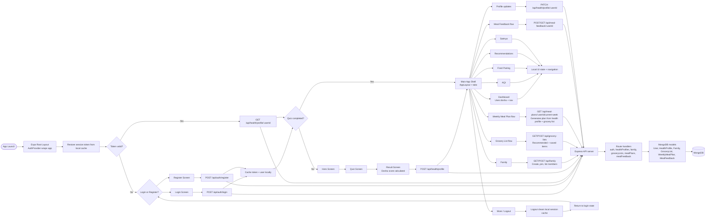

# Ayushya App Flow Chart

```mermaid
flowchart LR
  Start([App Launch]) --> Layout[Expo Root Layout\nAuthProvider wraps app]
  Layout --> Restore[Restore session token from local cache]
  Restore --> Validate{Token valid?}

  Validate -- No --> AuthChoice{Login or Register?}
  AuthChoice --> Login[Login Screen]
  AuthChoice --> Register[Register Screen]
  Login --> AuthAPI1[POST /api/auth/login]
  Register --> AuthAPI2[POST /api/auth/register]
  AuthAPI1 --> SaveToken[Cache token + user locally]
  AuthAPI2 --> SaveToken
  SaveToken --> QuizGate{Quiz completed?}

  Validate -- Yes --> ProfileCheck[GET /api/health/profile/:userId]
  ProfileCheck --> QuizGate

  QuizGate -- No --> Hero[Hero Screen]
  Hero --> Quiz[Quiz Screen]
  Quiz --> Result[Result Screen\nDosha score calculated]
  Result --> SaveProfile[POST /api/health/profile]
  SaveProfile --> MainApp

  QuizGate -- Yes --> MainApp[Main App Shell\nAppLayout + tabs]

  MainApp --> Dashboard[Dashboard\nUses dosha + nav]
  MainApp --> Recs[Recommendations]
  MainApp --> Satmya[Satmya]
  MainApp --> Pairing[Food Pairing]
  MainApp --> AQI[AQI]
  MainApp --> Family[Family]
  MainApp --> More[More / Logout]

  Family --> FamilyAPI[GET/POST /api/family\nCreate, join, list members]
  More --> Logout[Logout clears local session cache]
  Dashboard --> LocalUI[Local UI state + navigation]
  AQI --> LocalUI
  Pairing --> LocalUI
  Recs --> LocalUI
  Satmya --> LocalUI

  MainApp --> Grocery[Grocery List flow]
  Grocery --> GroceryAPI[GET/POST /api/grocery-lists\nRecommended + saved items]
  MainApp --> MealPlan[Weekly Meal Plan flow]
  MealPlan --> MealPlanAPI[GET /api/meal-plans/:userId/current-week\nGenerates plan from health profile + grocery list]
  MainApp --> Feedback[Meal Feedback flow]
  Feedback --> FeedbackAPI[POST/GET /api/meal-feedback/:userId]
  MainApp --> ProfileUpdate[Profile updates]
  ProfileUpdate --> HealthPatch[PATCH /api/health/profile/:userId]

  AuthAPI1 --> API[Express API server]
  AuthAPI2 --> API
  ProfileCheck --> API
  SaveProfile --> API
  FamilyAPI --> API
  GroceryAPI --> API
  MealPlanAPI --> API
  FeedbackAPI --> API
  HealthPatch --> API

  API --> Routes[Route handlers\nauth, healthProfiles, family, groceryLists, mealPlans, mealFeedback]
  Routes --> Models[MongoDB models\nUser, HealthProfile, Family, GroceryList, WeeklyMealPlan, MealFeedback]
  Models --> DB[(MongoDB)]

  Logout --> Reset[Return to login state]
  Reset --> AuthChoice
```

If you want, I can split this into separate charts for frontend screens, backend APIs, and data flow.